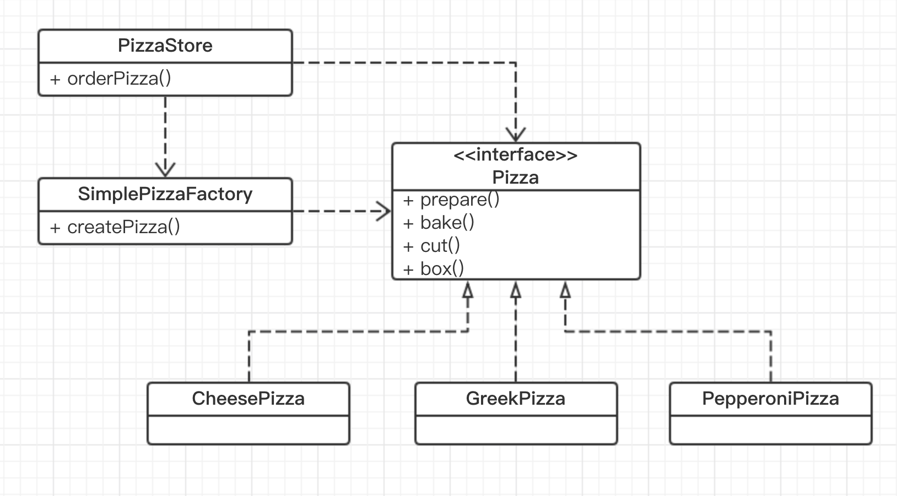
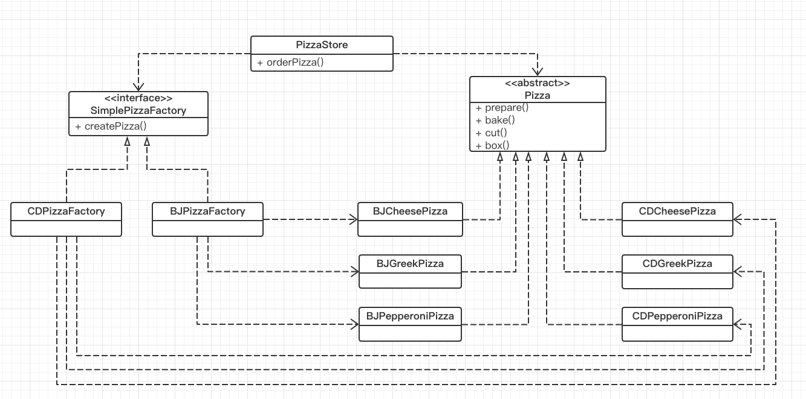
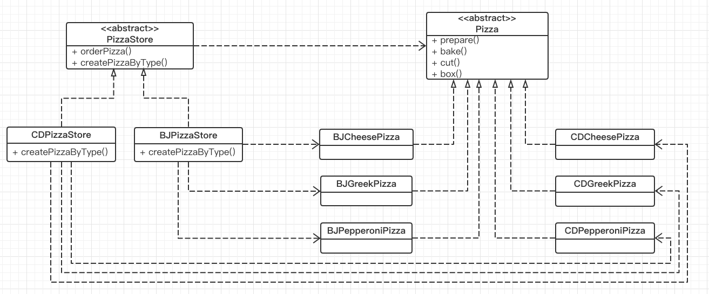
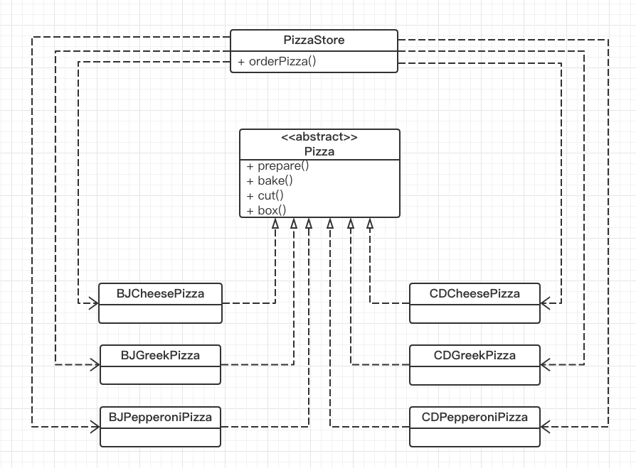
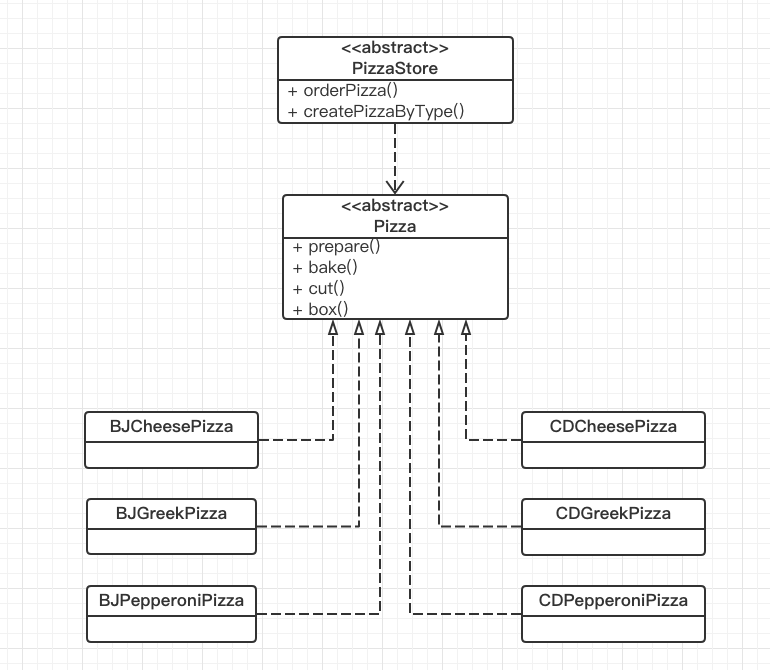
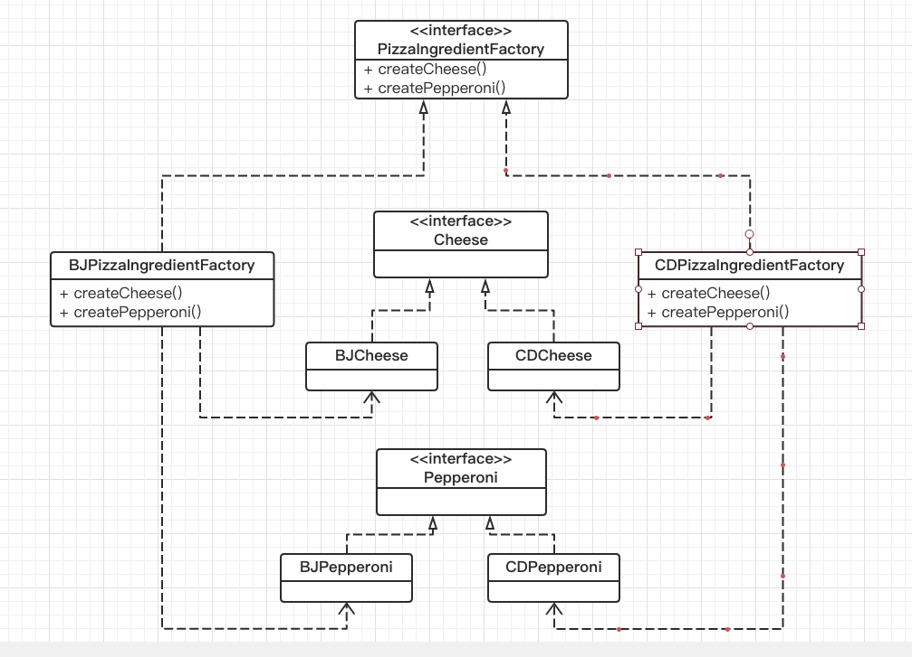

# 设计模式
## 什么是设计模式
可以用一句话概括设计模式———设计模式是一种利用 面向对象编程 的封装、继承和多态三大特性，同时在遵循各种设计原则的前提下，被总结出来的经过反复实践并被多数人知晓且经过分类和设计的可重用的软件设计方式。

首先呢先看这个，这些设计模式都是利用了面向对象的特性，其他的编程思想，比如面向过程和函数式编程并不适用。
其次呢这些设计模式需要遵守各种设计原则，比如开放闭合，依赖倒置，单一职责等等。当然了也不是说所有的职责都得遵守，只是说尽量去准守这些原则，设计的时候需要去权衡。
最后呢这些就是程序员们的程序设计的经验总结。是被主流工程师/架构师所广泛接受和使用的。

然后再回过来看看这个面向对象，根据上面的定义我们可以看出来面向对象是设计模式的基础，这些设计模式都是应用于面向对象程序设计中的。这里我再简单介绍下面向对象。
## 面向对象与面向过程
提到面向对象就不得不提面向过程。它们都是程序设计的思想。就像小说中的华山派的剑宗与气宗的分别一样，它们只是处理问题的思想不同，但是都能解决程序设计中问题。
- 面向过程设计程序的实质就是分析出解决问题所需要的步骤，然后用函数把这些步骤一步一步实现，使用的时候一个一个依次调用就可以了。

例如五子棋，面向过程的设计思路就是首先分析问题的步骤：
1、开始游戏，2、黑子先走，3、绘制画面，4、判断输赢，5、轮到白子，6、绘制画面，7、判断输赢，8、返回步骤2，9、输出最后结果。
- 面向对象是把构成问题事务分解成各个对象，建立对象的目的不是为了完成一个步骤，而是为了描叙某个事物在整个解决问题的步骤中的行为。

整个五子棋可以分为：1、黑白双方，这两方的行为是一模一样的，2、棋盘系统，负责绘制画面，3、规则系统，负责判定诸如犯规、输赢等。

第一类对象（玩家对象）负责接受用户输入，并告知第二类对象（棋盘对象）棋子布局的变化，棋盘对象接收到了棋子的变化就要负责在屏幕上面显示出这种变化，同时利用第三类对象（规则系统）来对棋局进行判定。

就像笑傲江湖中华山派的气宗干掉剑宗一样，现在主流的是面向对象这一设计思想。比如流行的 Java、C++、OC、Swift 等等都是面向对象的语言。（当然独孤九剑（C语言）也还存在，而且威力巨大）而且在面向对象思想的基础上人们又提出了各种设计模式。因此可以说面向对象是目前程序开发中最重要的思想。

## 对象


对象是面向对象编程的核心，我们在通过面向对象思想编写程序的时候需要创建各种对象。这是无法避免的，而当我们需要根据条件创建不同的对象时就会自然而然的出现下面的代码。

举个例子🌰

现在有个需求，一家披萨店提供披萨。

首先分析这个需求，抽象出来两个类披萨店和披萨。披萨店有一个方法来提供披萨。
代码实现。
定义一个 Pizza 的抽象类类, 它有 准备 prepare、烘焙 bake、切片 cut、装盒 box 这四个方法。 

我这里用到的代码都是swift，一些概念比如抽象类和抽象方法这些swift的语法层面没有这个概念，我在这里用协议（相当于java中的接口）和协议扩展来实现相同的作用。

```
protocol Pizza {
    func prepare()
    func bake()
    func cut()
    func box()
}

extension Pizza {
    func prepare() {}
    func bake() {}
    func cut() {}
    func box() {}
}
```
定义一个 PizzaStore 类， 它有一个提供披萨的方法 orderPizza。
```
class PizzaStore {
    
    func orderPizza() -> Pizza {
        let pizza = Pizza()
        
        pizza.prepare()
        pizza.bake()
        pizza.cut()
        pizza.box()
        
        return pizza
    }
}
```

这样以来我们就能通过披萨店来提供披萨了。创建一个 pizzaStore ，然后调用orderPizza 来获取 pizza

```
let pizzaStore = PizzaStore()
let pizza = pizzaStore.orderPizza()
```

但是上面是最简单的情况，正常情况下披萨店需要提供多种披萨，因此我们需要修改 orderPizza ，使其接收一个 type 的参数，然后根据参数来创建不同的披萨。

```
class PizzaStore {
    
    func orderPizza(type: String) -> Pizza? {
        var pizza: Pizza?
        
        if type == "cheese" {
            pizza = CheesePizza()
        } else if type == "greek" {
            pizza = GreekPizza()
        } else if type == "pepperoni" {
            pizza = PepperoniPizza()
        }
        
        pizza?.prepare()
        pizza?.bake()
        pizza?.cut()
        pizza?.box()
        
        return pizza;
    }
}
```
这样以来披萨店能提供了多种披萨，但是当披萨店增加或减少披萨种类的时候就需要修改上面 if else 的代码，而下面部分的代码是不动的。根据封装的思想，我们需要把上半部分给封装一下。这样就导入了另外一个类，SimplePizzaFactory 它专门用来生产披萨对象。

```
class SimplePizzaFactory {
    
    func createPizzaByType(type: String) -> Pizza? {
        var pizza: Pizza?
        
        if type == "cheese" {
            pizza = CheesePizza()
        } else if type == "greek" {
            pizza = GreekPizza()
        } else if type == "pepperoni" {
            pizza = PepperoniPizza()
        }
        
        return pizza;
    }
}
```

然后 PizzaStore 需要修改成下面这样

```
class PizzaStore {
    
    var factory: SimplePizzaFactory
    
    init(factory: SimplePizzaFactory) {
        self.factory = factory
    }
    
    func orderPizza(type: String) -> Pizza? {
        
        let pizza = self.factory.createPizzaByType(type: type)
        
        pizza?.prepare()
        pizza?.bake()
        pizza?.cut()
        pizza?.box()
        
        return pizza;
    }
}
```
这时候在创建 PizzaStore 的时候传入 SimplePizzaFactory 属性， 然后在 orderPizza 中通过 factory 来创建 pizza。

```
let factory = SimplePizzaFactory()
let pizzaStore = PizzaStore(factory: factory)
let pizza = pizzaStore.orderPizza(type: "cheese")
```

上面的这种设计方式就被称为简单工厂模式。与我们最初的代码相比，变化就是封装了 工厂类来封装创建代码。可能你会感觉这样设计也没有很大的好处，但是如果在其他地方也需要创建代码的时候就可以直接复用了。比如宅急送类是提供外卖功能的类。它也需要创建 Pizza，这时候就可以复用创建代码了。

## 简单工厂模式

类图


PizzaStore 依赖 factory 依赖 pizza

各种披萨继承自 pizza 抽象类。

### 简单工厂模式角色划分
- 客户 （上文中的 PizzaStore）：它是使用工厂来创建产品的类。
- 工厂角色（如上文中的 SimplePizzaFactory）：这是简单工厂模式的核心，由它负责创建所有的类的内部逻辑。当然工厂类必须能够被外界调用，创建所需要的产品对象。在上面的例子中则使用一个工厂属性来实现。而有些时候，工厂类提供一个静态方法，外部程序通过该静态方法创建所需对象，而不用实例化工厂对象。这被称为静态工厂，比上面的写法又简单一点。
- 抽象产品角色(如上文中的 Pizza)：简单工厂模式所创建的是所有对象的父类。注意，这里的父类可以是接口也可以是抽象类，它负责描述所创建实例共有的公共接口。
- 具体产品角色（如上文中的 CheesePizza，GreekPizza，PepperoniPizza）：简单工厂所创建的具体实例对象，这些具体的产品往往都拥有共同的父类。

## 工厂方法模式

回到刚才披萨店的例子，由于经营的很好，披萨店要扩大规模了。比如需要开两家分店--北京分店和成都分店。既然是分店，为了确保披萨的质量和品牌效应肯定需要使用之前经过时间考验的代码。但是由于地域的差异每个分店想要提供不同的风味的披萨（比如成都的分店少不了的变态辣口味的需求）。

### 简单工厂的做法

结合上面的简单工厂我们可以创建两种不同的工厂，把上面的 SimplePizzaFactory 抽象成接口，然后定义 BJPizzaFactory、CDPizzaFactory 实现接口。这时候通过创建不同的工厂然后创建不同的 PizzaStore ，然后调用 PizzaStore 的 orderPizza 来根据不同的工厂来实现提供不同风味披萨的需求。

```
protocol SimplePizzaFactory {
    func createPizzaByType(type: String) -> Pizza? 
}
```

```
let bjFactory = BJPizzaFactory()
let bjStore = PizzaStore(factory: bjFactory)
let bjPizza = bjStore.orderPizza(type: "cheese")

let cdFactory = CDPizzaFactory()
let cdStore = PizzaStore(factory: cdFactory)
let cdPizza = cdStore.orderPizza(type: "cheese")
```

类图



- PizzaStore 依赖 SimplePizzaFactory 和 Pizza
- BJPizzaFactory、CDPizzaFactory 实现了 SimplePizzaFactory 接口
- 各类的 pizza 继承自抽象类 pizza
- 各个工厂依赖于各个类型的 pizza

### 另一种做法

首先改造 PizzaStore 使它成为一个抽象类。

```
protocol PizzaStore {
    func orderPizza(type: String) -> Pizza?
    func createPizzaByType(type: String) -> Pizza?
}

extension PizzaStore {
    func orderPizza(type: String) -> Pizza? {
        let pizza = self.createPizzaByType(type: type)
        
        pizza?.prepare()
        pizza?.bake()
        pizza?.cut()
        pizza?.box()
        
        return pizza;
    }
}
```

可以看出跟上面简单工厂不同的就是把之前放到 工厂类里面的创建方法放回了 PizzaStore 但是声明为抽象方法。接着每个区域类型的店铺都继承自该抽象类。然后实现抽象方法。这样以来如何制造披萨就由每个子类自己来控制。

```
class BJPizzaStore: PizzaStore {
    func createPizzaByType(type: String) -> Pizza? {
        var pizza: Pizza?
        
        if type == "cheese" {
            pizza = BJCheesePizza()
        } else if type == "greek" {
            pizza = BJGreekPizza()
        } else if type == "pepperoni" {
            pizza = BJPepperoniPizza()
        }
        
        return pizza;
    }
}
```

使用的时候只用创建不同的披萨店，然后使用它的 orderPizza 方法就能获得披萨对象。
```
let bjStore = BJPizzaStore()
let bjPizza = bjStore.orderPizza(type: "cheese")

let cdStore = CDPizzaStore()
let cdPizza = cdStore.orderPizza(type: "cheese")
```

类图


- 抽象类 PizzaStore 依赖 pizza 抽象类
- BJPizzaStore、CDPizzaStore 继承自 PizzaStore
- BJPizzaStore、CDPizzaStore 依赖 具体 pizza 类
- 各类的 pizza 继承自抽象类 pizza


### 声明一个工厂方法
在简单工厂里面通过一个对象负责所有具体类的实例化，现在经过修改变成了由一群子类来负责实例化。

我们再来看一下

```
protocol PizzaStore {
    func orderPizza(type: String) -> Pizza?
    func createPizzaByType(type: String) -> Pizza?
}

extension PizzaStore {
    func orderPizza(type: String) -> Pizza? {
        let pizza = self.createPizzaByType(type: type)
        
        pizza?.prepare()
        pizza?.bake()
        pizza?.cut()
        pizza?.box()
        
        return pizza;
    }
}
```
可以看出来实例化披萨的责任被转移到了一个方法中，这个方法就如同一个工厂。以此这个方法称为工厂方法。

工厂方法用来处理对象的创建，并将这些创建的行为封装在子类中。这样以来客户程序中父类的代码就跟子类的创建代码解耦了。

## 工厂方法模式的定义
一个抽象类定义了一个创建对象的接口，但是由子类决定要实例化的具体类是哪个。这个所谓的决定并不是说子类在运行时决定，而是说在编写创建者类的时候，选择了哪个子类自然就决定了实际创建的产品是什么了。

### 角色
- 客户 （抽象类 PizzaStore）：与简单工厂一样它不负责创建对象。
- 工厂角色（具体类 BJPizzaStore、CDPizzaStore）： PizzaStore 的子类通过重写父类的 createPizzaByType 方法来确定自己的实现代码，用来创建自己风味的披萨。
- 抽象产品角色( Pizza)：与简单工厂模式一样它是所有要创建对象的父类。注意，这里的父类可以是接口也可以是抽象类，它负责描述所创建实例共有的公共接口。
- 具体产品角色（如上文中的 BJCheesePizza，CDCheesePizza）

### 依赖倒置原则

依赖倒置是设计模式中一个设计原则，工厂模式很好的体现了这个原则。然后要理解这个原则要先了解什么是依赖。个人认为所谓的依赖就是当你在某个类中使用到另外的类，二者就产生了依赖关系。

然后来看一下不使用工厂模式的时候我们创建披萨的代码。

```
class DependentPizzaStore {
    func orderPizza(style: String, type: String) -> Pizza? {
        var pizza: Pizza?
        if style == "BJ" {
            if type == "cheese" {
                pizza = BJCheesePizza()
            } else if type == "greek" {
                pizza = BJGreekPizza();
            } else if type == "pepperoni" {
                pizza = BJPepperoniPizza();
            }
        } else if style == "CD" {
            if type == "cheese" {
                pizza = CDCheesePizza()
            } else if type == "greek" {
                pizza = CDGreekPizza();
            } else if type == "pepperoni" {
                pizza = CDPepperoniPizza();
            }
        }
        
        pizza?.prepare();
        pizza?.bake();
        pizza?.cut();
        pizza?.box();
        
        return pizza;
    }
}
```

简单来说就是根据style 和type 来创建不同披萨。然后对披萨做一些处理。

类图


这个版本的 pizzastore 依赖于所有的披萨对象，因为它直接创建这些披萨对象。
每新增一个披萨类型就相当于让 pizzastore 多了一个依赖
如果这些披萨的实现改变了就必须修改 pizzastore

这些就是依赖的坏处，代码中减少对具体类的依赖是件好事。

然后我们看一下使用了工厂方法模式之后 pizzastore 的依赖关系。（删除了与pizzastore 无依赖的部分）



这个版本的 pizzastore 依赖于抽象类 pizza 
各种具体的披萨类也依赖于抽象类 pizza
这样以来高层组件（pizzastore）和低层组件（各类披萨）都依赖了 抽象类 pizza。

通过对比我们可以看到没使用工厂方法的依赖是由上而下的即高层组件依赖低层组件
使用工厂方法之后依赖关系倒置了，高层组件不再依赖低层组件，只依赖抽象类。

## 抽象工厂模式

再次回到披萨店的例子里，披萨店成功的关键在于新鲜高质量的原料，但是会有一些分店使用廉价的原料来增加利润，为了维护披萨店的品牌我们需要采取一些手段。

最直接的做法就是由总部提供各种原料并运送到各家加盟店。但是由于地理位置较远以及各个地区口味不同原料也可能存在一些微小的差别。因此我们进行下面的设计。

### 添加原料类族

```
class Cheese {
    
}

class BJCheese: Cheese{
    
}

class CDCheese: Cheese {
    
}
```

```
class Pepperoni {
    
}

class BJPepperoni: Pepperoni {
    
}

class CDPepperoni: Pepperoni {
    
}
```

### 添加原料工厂

通过原料工厂来创建原料家族中的每个原料。

首先定义一个接口，其中定义了每种原料对应的创建方法。
```
protocol PizzaIngredientFactory {
    func creatCheese() -> Cheese
    func creatPepperoni() -> Pepperoni
}
```

然后为每个区域的分店创建实现上面接口的类来实现创建方法。

```
class BJPizzaIngredientFactory: PizzaIngredientFactory {
    func creatCheese() -> Cheese {
        return BJCheese()
    }
    
    func creatPepperoni() -> Pepperoni {
        return BJPepperoni()
    }
}
```
```
class CDPizzaIngredientFactory: PizzaIngredientFactory {
    func creatCheese() -> Cheese {
        return CDCheese()
    }
    
    func creatPepperoni() -> Pepperoni {
        return CDPepperoni()
    }
}
```

然后修改 Pizza 类,主要就是为其添加各种原料的属性并抽象化 prepare 方法。prepare 方法里会添加各种来自于原料工厂的原料。

需要注意的还有 ingredientFactory 这个属性，它是为制作披萨提供原料的，每个 Pizza 都需要在初始化方法中得到一个工厂存储在属性中。

```
class Pizza {
    var name: String = ""
    var cheese: Cheese?
    var pepperoni: Pepperoni?
    
    var ingredientFactory: PizzaIngredientFactory

    init(ingredientFactory: PizzaIngredientFactory) {
        self.ingredientFactory = ingredientFactory
    }
    
    // swift 中没有抽象方法这个概念。因此在这添加断言，子类不复写就会报错
    func prepare() {
        assert(true, "Pizza 子类必须重写 prepare 方法")
    }
    
    func bake() {
        print("350 度下烘烤 25 分钟...")
    }
    func cut() {
        print("切片...")
    }
    func box() {
        print("装盒...")
    }
}
```

接着由于披萨的口味由原料来决定，我们在这里不需要像工厂方法模式里那样创建各个地区对应的披萨了。让原料工厂来处理地区差异就行了。

```
class CheesePizza: Pizza {
    override func prepare() {
        print("Preparing " + name)
        self.cheese = self.ingredientFactory.creatCheese()
    }
}

class PepperoniPizza: Pizza {
    override func prepare() {
        print("Preparing " + name)
        self.pepperoni = self.ingredientFactory.creatPepperoni()
    }
}
```

通过上面这一步 Pizza 类不需要关心原料的问题了，只需要关注披萨的制作等问题，这样一来 Pizza 和区域原料之间就解耦了。

回到披萨店，我们需要让他们与本地的原料工厂连接上关系。

```
class BJPizzaStore: PizzaStore {
    func createPizzaByType(type: String) -> Pizza? {
        var pizza: Pizza?
        let ingredientFactory = BJPizzaIngredientFactory()
        
        if type == "cheese" {
            pizza = CheesePizza(ingredientFactory: ingredientFactory)
            pizza!.name = "北京起司披萨"
        } else if type == "pepperoni" {
            pizza = PepperoniPizza(ingredientFactory: ingredientFactory);
            pizza!.name = "北京烤香肠披萨"
        }
        
        return pizza;
    }
}
```

```
class CDPizzaStore: PizzaStore {
    func createPizzaByType(type: String) -> Pizza? {
        var pizza: Pizza?
        let ingredientFactory = CDPizzaIngredientFactory()
        
        if type == "cheese" {
            pizza = CheesePizza(ingredientFactory: ingredientFactory)
            pizza!.name = "成都起司披萨"
        } else if type == "pepperoni" {
            pizza = PepperoniPizza(ingredientFactory: ingredientFactory);
            pizza!.name = "成都烤香肠披萨"
        }
        
        return pizza;
    }
}
```

经过上面的改造之后我们提供披萨的方法并不需要修改

```
let bjStore = BJPizzaStore()
let bjPizza = bjStore.orderPizza(type: "cheese")

let cdStore = CDPizzaStore()
let cdPizza = cdStore.orderPizza(type: "cheese")
```

类图


由于全部的类图太多负责，这里只列出抽象工厂相关的类。
抽象工厂类 PizzaIngredientFactory 与各个原料的抽象类并不产生依赖关系
具体工厂类 BJPizzaIngredientFactory、CDPizzaIngredientFactory 依赖于各自对应的具体原料类 

### 抽象工厂定义

抽象工厂提供一系列创建多个抽象产品的接口，所有的具体的工厂都必须实现这些接口来生产产品。客户中的代码只涉及抽象工厂，具体运行时会自动使用具体工厂。
抽象工厂模式与工厂方法模式最大的区别在于抽象工厂中每个工厂可以创建多个种类的产品。

### 抽象工厂模式角色划分
- 抽象产品（或者产品接口），如上文类图中的 Cheese，Pepperoni
- 具体产品，如 BJPepperoni， CDPepperoni 等
- 抽象工厂（或者工厂接口），如 PizzaIngredientFactory
- 具体工厂，如BJPizzaIngredientFactory，BJPizzaIngredientFactory、CDPizzaIngredientFactory

 抽象工厂模式隔离了具体类的生成，使得客户并不需要知道什么被创建。由于这种隔离，更换一个具体工厂就变得相对容易。所有的具体工厂都实现了抽象工厂中定义的那些公共接口，因此只需改变具体工厂的实例，就可以在某种程度上改变整个软件系统的行为。另外，应用抽象工厂模式可以实现高内聚低耦合的设计目的，因此抽象工厂模式得到了广泛的应用。

## 总结

- 所有的工厂都是用来封装对象的创建
- 简单工厂比较简单，但是不失为一个将客户从具体类中解耦的一种方法
- 工厂方法使用继承：把对象的创建委托给子类，子类实现工厂方法来创建对象
- 抽象工厂使用对象组合：对象的创建在抽象工厂接口的实现中。
- 所有的工厂模式都通过减少客户对象与具体类之间的依赖来降低耦合